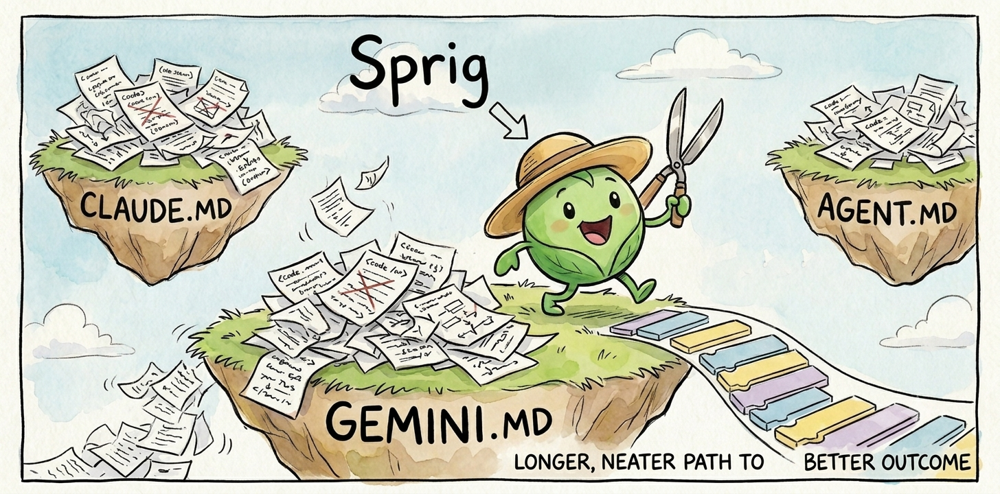
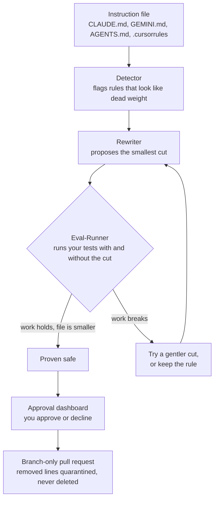

<p align="center">
  
</p>

# SprigAgent

SprigAgent prunes the instruction files your coding agent reads, the rule files like CLAUDE.md, GEMINI.md, and AGENTS.md that build up over time and slow it down. It removes the rules that are no longer necessary, but only after it proves each cut is safe and you approve it.

Other tools guess which rules are dead weight and delete them. SprigAgent does not guess. It runs your coding agent with and without each rule inside a sandbox and checks the result against your test suite, the automated checks that already confirm your code works. Nothing changes until you approve it.

---

## The problem: context rot

Instruction files grow. Rules pile up, repeat each other, and go stale, burying the ones that matter. Because an agent follows instructions by probability rather than by fixed rule, nobody can say for certain which lines are load-bearing and which are dead weight. The file gets longer, the agent gets slower, and its output gets worse. That is context rot.

The research backs this up:

- [Chroma (2025)](https://research.trychroma.com/context-rot) tested 18 frontier models. Every one of them got worse as its context grew.
- [Liu et al. at Stanford (2024)](https://arxiv.org/abs/2307.03172) found accuracy falling from roughly 75% to roughly 55% based only on where a fact sat in the context, before the content changed at all.
- [SWE-Pruner (2026)](https://arxiv.org/abs/2601.16746) found that file-reading alone eats up 76.1% of a coding agent's tokens.

Cutting rules by hand is a gamble. Remove a load-bearing line and the agent quietly gets worse, with no warning. SprigAgent takes the gamble out by proving each cut before you ever see it.

---

## Try it in five minutes (no credentials)

You need Python 3.10+ (in a virtualenv) and Node 18+.

```bash
git clone https://github.com/Jacks-stack976/SprigAgent
cd SprigAgent
python -m venv .venv && source .venv/bin/activate
make demo
```

`make demo` installs everything and opens the approval dashboard at http://127.0.0.1:8765. While the terminal stays open, the dashboard is running, so leave it going. It works against a small sample project with no cloud login and no API keys, playing back a saved recording of a real Gemini 2.5 Pro run.

You will watch it make two decisions:

- One cut it approves for you to sign off on. Removing a redundant style section keeps the agent at 100% on its tasks while cutting the file by 34.9% (631 tokens down to 411). Click Approve and it stages a pull request on a new branch.
- One cut it refuses. Removing a money-convention rule that actually matters drops the agent to 3 of 4 tasks passing, so SprigAgent will not let you approve it. That refusal is the whole idea. It will not rubber-stamp a change that makes things worse.

### Prove it yourself

You do not have to take the demo's word for it. One command proves the headline number straight from the saved recording, with no Node and no cloud:

```bash
pytest tests/eval/test_replay_proof.py
```

If that passes, the 34.9% saving is real and it came from a genuine model run, not a figure we typed in. This is the shortest path to confidence: clone, run one test, see the number for yourself.

---

## How it works



The engine reads the instruction file and finds a rule to cut. Then it does the part that makes it trustworthy. It copies the file into a sandbox, removes the rule, and runs your tests twice: once with the rule, once without. If the work still passes and the file is smaller, the cut is proven. If the work breaks, it tries a gentler edit; if nothing works, it keeps the rule and moves on. Only proven cuts reach you, and you have the final say.

Your tests are yours, not something SprigAgent wrote, and that is the point. It can only call a cut safe when something it did not invent agrees. It works on any instruction file, and it always tests the exact file it is cutting from. The one thing you need is a test suite that covers what the file affects.

---

## Built on Gemini, works with any coding tool

The engine that runs the proof is Gemini 2.5 Pro on Vertex AI, so SprigAgent is Google-native and is not tied to Claude or any single assistant. It prunes instruction files for whatever tool you use (Claude Code, Gemini CLI, Cursor, and others) because it reads the instructions as plain text and does not care about the filename. If you work in Gemini, it runs the same way it does for anyone else.

---

## Where each required concept lives

| Concept | Where it lives | What it does |
|---|---|---|
| Multi-agent orchestration (Google ADK) | `src/sprigagent/agents/` (`detector.py`, `rewriter.py`, `eval_runner.py`) and `src/sprigagent/orchestrate.py` | Four ADK agents run the find, prove, and decide loop |
| Model Context Protocol (MCP) | `src/sprigagent/github_client.py` (`GithubMcpClient`) and `src/sprigagent/apply.py` (`--client mcp`) | Opens the branch-only pull request over MCP. A `gh` CLI backend is the default, and MCP drops in behind the same interface |
| Security | `src/sprigagent/security/checkpoint.py` | Scrubs PII and screens for prompt injection before anything reaches the model |

---

## Run it on your own repo

SprigAgent is not limited to the sample project. Here is how to point it at your own code.

First, make sure your repo has a test suite that exercises whatever your instruction file governs. This is the one piece SprigAgent will not create for you, and that is deliberate. Those tests are the independent judge that makes the proof mean something. If SprigAgent wrote its own tests, it would be grading its own homework, and the guarantee would be worthless.

Then point it at any instruction file in your repo:

```bash
python -m sprigagent.ui /path/to/your/repo --file CLAUDE.md
```

Swap `CLAUDE.md` for `GEMINI.md`, `AGENTS.md`, `.cursorrules`, or any other instruction file. The dashboard opens the same way and shows you the proven cuts to approve or decline.

The sample demo runs off a saved recording, so it needs no credentials. Running live against your own code uses Gemini through Vertex AI, so you set the environment variables listed in `.env.example` (your Google Cloud project, location, and model). Your code never leaves your machine except for the model calls, and removed lines are quarantined rather than deleted, so nothing is ever lost.

What it does:

- Prunes any instruction file, for any coding tool, proving each cut against your tests.
- Handles several instruction files in one repo. It reads the others to catch rules that repeat or contradict across files.
- Lands every change on a new branch, never on `main`, and always waits for your approval.

What it will not do:

- Touch your application code. It edits instruction files only, because a rule change is something you can prove by watching the agent, while a code deletion is not.
- Write your tests. You bring those, and that independence is what makes the proof trustworthy.

---

## How it keeps you safe

A few rules are built in and never bend.

Your file's text is scrubbed and screened before any model sees it. SSNs and credit-card numbers are redacted. Attempts to hijack the agent, override its rules, or leak data are caught and sent to human review instead of to the model. Anything a tool or a file hands back is treated as data, never as a command.

On top of that, cuts land on a new branch and never on `main`, removed lines are quarantined rather than deleted so you can always get them back, and a person approves every change. Nothing is applied on its own. The security check lives in `src/sprigagent/security/checkpoint.py`.

---

## License and links

- License: CC-BY 4.0
- Main repo: https://github.com/Jacks-stack976/SprigAgent
- Sample testbed: https://github.com/Jacks-stack976/sprig-demo
- Second testbed, a different kind of project: https://github.com/Jacks-stack976/sprig-e2e-testbed
